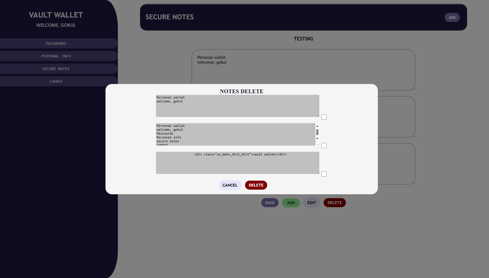

# VAULT-WALLET

Vault Wallet is a secure web-based Application desigened to store and manage sensitive user data like PASSWORDS, SECURE NOTES AND PERSONAL INFORMATION. The project uses Cryptography for encrypting and decrypting the user data, ensuring privacy and security. 

# FEATURES 
- Save and Manage account credentails with encryption. 
- Write and store a notes safety with end to end encryption.
- Keep personal data details in a protected envirnoment.
- Login and register system for access informations.
- PostgreSQL used to ensure scalability, reliability, and efficient data management. 
- Focuses on clean User Interface (UI) 
- Smoothly Animated and provides clean Responsive design  

# TECHNOLOGIES USED 
- <span style="color:lightblue">**BACKEND :** </span>DJANGO, PYHTON, CRYPTOGRAPHY, PYTHON-DOTENV
- <span style="color:lightblue">**FRONTEND :**</span>  HTML, CSS, JAVASCRIPT
- <span style="color:lightblue">**DATABASE :**</span> POSTGRESQL 
- <span style="color:lightblue">**VERSION CONTROL**</span> GIT & GITHUB  

# INSTALLATION  

### 1. Clone the Repository 
```bash
    git clone https://github.com/GOKUL988/Vault-Wallet.git
```
```bash
    cd Vault-Wallet
```

### 2. Create & Activate Virtual Environment 
```bash
    python -m venv .venv
```
```bash
    ./.venv/scripts/activate
```

### 3. Install Dependencies 
```bash
    pip install -r requirements.txt
```

### 4. Create .env file
- Create a new file and named to .env where (manage.py) is located
```bash 
    .env 
```
- Add a sensitive variables like this
```bash
# Security
_KEY=your-secret-key

# Database
DB_NAME=database_name
DB_USER=dbuser
DB_PASSWORD=dbpassword
DB_HOST=******* like localhost
DB_PORT=****
```
- key Creation 
```bash
    runs crypt_key_gen.py 
```
```bash 
    copy the key and paste to .env _KEY
```

### 5. Apply the migrations 
```bash
    python manage.py makemigrations
```
```bash
    python manage.py migrate 
```

### 5. Create SuperUser (optional) 
- Handles data flows
```bash
    python manage.py createsuperuser
```

### 6. Run Server 
```bash 
    python manage.py runserver
``` 

# SCREENSHOTS 
 
# 
 
# 
 
# 
 
# 
 
# 
 
# 
 
# 
 
# 
 
# 
 
# 
 
# 
 
# 
 
# 
 
# 
 
# 
 
# 
 
# 

## License 
- This Project is licensed under the [MIT License](LICENSE) 

## Developer 
- GOKUL 
- ** 📧 Email :** [gs164945@gmail.com](mailto:gs164945@gmail.com) 
- **🌐 GitHub Portfolio :**[LINK](https://gokul988.github.io/Portfolio_web/)